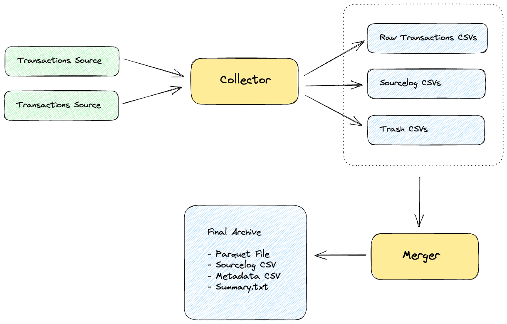

# Mempool Dumpster 🗑️♻️

[](https://goreportcard.com/report/github.com/flashbots/mempool-dumpster)
[](https://github.com/flashbots/mempool-dumpster/actions?query=workflow%3A%22Checks%22)

Archiving mempool transactions in [Parquet](https://github.com/apache/parquet-format) and CSV format.

**The data is freely available at https://mempool-dumpster.flashbots.net**

Overview:

- Data is published under the [CC-0 public domain license](https://creativecommons.org/publicdomain/zero/1.0/)
- Saving about 1M - 2M unique transactions per day
- This project is under active development and the codebase might change significantly without notice. The functionality itself is pretty stable.
- Related tooling: https://github.com/dvush/mempool-dumpster-rs
- Introduction & guide: https://collective.flashbots.net/t/mempool-dumpster-a-free-mempool-transaction-archive/2401
- Mempool dumpster data is also available through [BigQuery](https://console.cloud.google.com/bigquery/analytics-hub/exchanges/projects/1035301635708/locations/us/dataExchanges/ethereum_mempool_dumpster_by_flashbots_1953788a09b/listings/ethereum_mempool_dumpster_community_dataset_by_flashbots_19537a4ec38) and [Dune](https://www.dune.com)(dune.flashbots.dataset_mempool_dumpster).

---

## Available mempool transaction sources

1. Generic EL nodes - go-ethereum, Infura, etc. (Websockets, using `newPendingTransactions`)
2. Alchemy (Websockets, using [`alchemy_pendingTransactions`](https://docs.alchemy.com/reference/alchemy-pendingtransactions), warning - burns a lot of credits)
3. [bloXroute](https://docs.bloxroute.com/streams/newtxs-and-pendingtxs) (Websockets and gRPC)
4. [Chainbound Fiber](https://fiber.chainbound.io/docs/usage/getting-started/) (gRPC)
5. [Eden](https://docs.edennetwork.io/eden-rpc/speed-rpc) (Websockets and gRPC)

Note: Some sources send transactions that are already included on-chain, which are discarded (not added to archive or summary)

---

## Output files

Daily files uploaded by mempool-dumpster (i.e. for [September 2023](https://mempool-dumpster.flashbots.net/ethereum/mainnet/2023-09/index.html)):

1. Parquet file with [transaction metadata and raw transactions](/common/types.go#L7) (~800MB/day, i.e. [`2023-09-08.parquet`](https://mempool-dumpster.flashbots.net/ethereum/mainnet/2023-09/2023-09-08.csv.zip))
1. CSV file with only the transaction metadata (~100MB/day zipped, i.e. [`2023-09-08.csv.zip`](https://mempool-dumpster.flashbots.net/ethereum/mainnet/2023-09/2023-09-08.csv.zip))
1. CSV file with details about when each transaction was received by any source (~100MB/day zipped, i.e. [`2023-09-08_sourcelog.csv.zip`](https://mempool-dumpster.flashbots.net/ethereum/mainnet/2023-09/2023-09-08_sourcelog.csv.zip))
1. Summary in text format (~2kB, i.e. [`2023-09-08_summary.txt`](https://mempool-dumpster.flashbots.net/ethereum/mainnet/2023-09/2023-09-08_summary.txt))

### Schema of output files

**Parquet**

```bash
$ clickhouse local -q "DESCRIBE TABLE 'transactions.parquet';"
timestamp               Nullable(DateTime64(3))
hash                    Nullable(String)
chainId                 Nullable(String)
txType                  Nullable(Int64)
from                    Nullable(String)
to                      Nullable(String)
value                   Nullable(String)
nonce                   Nullable(String)
gas                     Nullable(String)
gasPrice                Nullable(String)
gasTipCap               Nullable(String)
gasFeeCap               Nullable(String)
dataSize                Nullable(Int64)
data4Bytes              Nullable(String)
sources                 Array(Nullable(String))
includedAtBlockHeight   Nullable(Int64)
includedBlockTimestamp  Nullable(DateTime64(3))
inclusionDelayMs        Nullable(Int64)
rawTx                   Nullable(String)
```

**CSV**

Same as parquet, but without `rawTx`:

```
timestamp_ms,hash,chain_id,from,to,value,nonce,gas,gas_price,gas_tip_cap,gas_fee_cap,data_size,data_4bytes,sources,included_at_block_height,included_block_timestamp_ms,inclusion_delay_ms,tx_type
```

---

## FAQ

- **_When is the data uploaded?_** ... The data for the previous day is uploaded daily between UTC 4am and 4:30am.
- **_What about transactions that are already included on-chain?_** ... Some sources send transactions even after they have been included on-chain. When a transaction is received, mempool-dumpster checks if it has been included already, and if so discards it from the transaction files (note: it is still added to the sourcelog).
- **_What is `inclusionDelayMs`, and why can it be negative?_**
    - When a block is included on-chain, it includes a `block.timestamp` field.
    - `inclusionDelayMs = (block.timestamp * 1000) - MempoolDumpster.receivedAtMs`
    - Block builders set `block.timestamp`, typically to the beginning of the slot.
    - A slot is 12 seconds. If mempool dumpster receives a transaction in the middle of the slot (i.e. `t=6`), it could get included in the current slot. In this case, the builder would set the timestamp to `t=0`, i.e. 6 seconds before MD has seen the transaction. This scenario would result in a negative `inclusionDelay` value (i.e. `inclusionDelayMs=-6000`).
- **_What are exclusive transactions?_** ... a transaction that was seen from no other source (transaction only provided by a single source). These transactions might include recycled transactions (which were already seen long ago but not included, and resent by a transaction source).
- **_What does "XOF" stand for?_** ... XOF stands for "exclusive orderflow" (i.e. exclusive transactions).
- **_What is a-pool?_** ... A-Pool is a regular geth node with some optimized peering settings, subscribed to over the network.
- **_gRPC vs Websockets?_** ... bloXroute and Chainbound are connected with gRPC, all other sources are connected with Websockets (note that gRPC has a lower latency than WebSockets).

---

# Working with Parquet

[Apache Parquet](https://parquet.apache.org/) is a column-oriented data file format designed for efficient data storage and retrieval. It provides efficient data compression and encoding schemes with enhanced performance to handle complex data in bulk (more [here](https://www.databricks.com/glossary/what-is-parquet#:~:text=What%20is%20Parquet%3F,handle%20complex%20data%20in%20bulk.)).

We recommend to use [ClickHouse local](https://clickhouse.com/docs/en/operations/utilities/clickhouse-local) (as well as [DuckDB](https://duckdb.org/)) to work with Parquet files, it makes it easy to run [queries](https://clickhouse.com/docs/en/sql-reference/statements) like:

```bash
# count rows
$ clickhouse local -q "SELECT count(*) FROM 'transactions.parquet' LIMIT 1;"

# count by transaction type
$ clickhouse local -q "SELECT txType, COUNT(txType) FROM 'transactions.parquet' GROUP BY txType;"

# show hash+rawTx from first entry
$ clickhouse local -q "SELECT hash,hex(rawTx) FROM 'transactions.parquet' LIMIT 1;"

# details of a particular hash
$ clickhouse local -q "SELECT timestamp,hash,from,to,hex(rawTx) FROM 'transactions.parquet' WHERE hash='0x152065ad73bcf63f68572f478e2dc6e826f1f434cb488b993e5956e6b7425eed';"

# all transactions seen from mempoolguru
$ clickhouse local -q "SELECT COUNT(*) FROM 'transactions.parquet' WHERE has(sources, 'mempoolguru');"

# all transactions that were seen by both mempoolguru and chainbound
$ clickhouse local -q "SELECT COUNT(*) FROM 'transactions.parquet' WHERE hasAll(sources, ['mempoolguru', 'local']);"

# exclusive transactions from bloxroute
$ clickhouse local -q "SELECT COUNT(*) FROM 'transactions.parquet' WHERE length(sources) == 1 AND sources[1] == 'bloxroute';"

# count of landed vs not-landed exclusive transactions, by source
$ clickhouse local -q "WITH includedBlockTimestamp!=0 as included SELECT sources[1], included, count(included) FROM 'out/out/transactions.parquet' WHERE length(sources) == 1 GROUP BY sources[1], included;"

# uniswap v2 transactions
$ clickhouse local -q "SELECT COUNT(*) FROM 'transactions.parquet' WHERE to='0x7a250d5630b4cf539739df2c5dacb4c659f2488d';"

# uniswap v2 transactions and separate by included/not-included
$ clickhouse local -q "WITH includedBlockTimestamp!=0 as included SELECT included, COUNT(included) FROM 'transactions.parquet' WHERE to='0x7a250d5630b4cf539739df2c5dacb4c659f2488d' GROUP BY included;"

# inclusion delay for uniswap v2 transactions (time between receiving and being included on-chain)
$ clickhouse local -q "WITH inclusionDelayMs/1000 as incdelay SELECT quantiles(0.5, 0.9, 0.99)(incdelay), avg(incdelay) as avg FROM 'transactions.parquet' WHERE to='0x7a250d5630b4cf539739df2c5dacb4c659f2488d' AND includedBlockTimestamp!=0;"

# count uniswap v2 contract methods
$ clickhouse local -q "SELECT data4Bytes, COUNT(data4Bytes) FROM 'transactions.parquet' WHERE to='0x7a250d5630b4cf539739df2c5dacb4c659f2488d' GROUP BY data4Bytes;"
```

See this post for more details: https://collective.flashbots.net/t/mempool-dumpster-a-free-mempool-transaction-archive/2401

---

## Running the analyzer

You can easily run the included analyzer to create summaries like [2023-09-22_summary.txt](https://mempool-dumpster.flashbots.net/ethereum/mainnet/2023-09/2023-09-22_summary.txt):

1. First, download the parquet and sourcelog files from https://mempool-dumpster.flashbots.net/ethereum/mainnet/2023-09
2. Then run the analyzer:

```bash
go run cmd/analyze/* \
    --out summary.txt \
    --input-parquet /mnt/data/mempool-dumpster/2023-09-22/2023-09-22.parquet \
    --input-sourcelog /mnt/data/mempool-dumpster/2023-09-22/2023-09-22_sourcelog.csv.zip
```

To speed things up, you can use the `MAX` environment variable to set a maximum number of transactions to process:

```bash
MAX=10000 go run cmd/analyze/* \
    --out summary.txt \
    --input-parquet /mnt/data/mempool-dumpster/2023-09-22/2023-09-22.parquet \
    --input-sourcelog /mnt/data/mempool-dumpster/2023-09-22/2023-09-22_sourcelog.csv.zip
```

## Interesting analyses

- Something interesting with `inclusionDelay`?
- Trash transactions (invalid nonce, not enough sender funds)

Feel free to continue the conversation in the [Flashbots Forum](https://collective.flashbots.net/t/mempool-dumpster-a-free-mempool-transaction-archive/2401)!

---

# System architecture

1. [Collector](cmd/collect/main.go): Connects to EL nodes and writes new mempool transactions and sourcelog to hourly CSV files. Multiple collector instances can run without colliding.
2. [Merger](cmd/merge/main.go): Takes collector CSV files as input, de-duplicates, checks transaction inclusion status, sorts by timestamp and writes output files (Parquet, CSV and Summary).
3. [Analyzer](cmd/analyze/main.go): Analyzes sourcelog CSV files and produces summary report.
4. [Website](cmd/website/main.go): Website dev-mode as well as build + upload.




---

# Getting started

## Mempool Collector

1. Subscribes to new pending transactions at various data sources
1. Writes 3 files:
    1. Transactions CSV: `timestamp_ms, hash, raw_tx` (one file per hour by default)
    1. Sourcelog CSV: `timestamp_ms, hash, source` (one entry for every single transaction received by any source)
    1. Trash CSV: `timestamp_ms, hash, source, reason, note` (trash transactions received by any source, these are not added to the transactions CSV. currently only if already included in previous block)
1. Note: the collector can store transactions repeatedly, and only the merger will properly deduplicate them later

**Default filenames:**

Transactions
- Schema: `<out_dir>/<date>/transactions/txs_<date>_<uid>.csv`
- Example: `out/2023-08-07/transactions/txs_2023-08-07-10-00_collector1.csv`

Sourcelog
- Schema: `<out_dir>/<date>/sourcelog/src_<date>_<uid>.csv`
- Example: `out/2023-08-07/sourcelog/src_2023-08-07-10-00_collector1.csv`

Trash
- Schema: `<out_dir>/<date>/trash/trash_<date>_<uid>.csv`
- Example: `out/2023-08-07/trash/trash_2023-08-07-10-00_collector1.csv`

**Running the mempool collector:**

```bash
# print help
go run cmd/collect/main.go -help

# Connect to ws://localhost:8546 and write CSVs into ./out
go run cmd/collect/main.go -out ./out

# Connect to multiple nodes
go run cmd/collect/main.go -out ./out -nodes ws://server1.com:8546,ws://server2.com:8546
```

## Merger

- Iterates over collector output directory / CSV files
- Deduplicates transactions, sorts them by timestamp

```bash
# print help
go run cmd/merge/* -h

# deduplicate transactions
go run cmd/merge/* transactions --check-node ws://server1.com ./out/2023-08-07/transactions/txs_2023-08-07-10-00_collector1.csv
```


---

# Architecture

## General design goals

- Keep it simple and stupid
- Vendor-agnostic (main flow should work on any server, independent of a cloud provider)
- Downtime-resilience to minimize any gaps in the archive
- Multiple collector instances can run concurrently, without getting into each others way
- Merger produces the final archive (based on the input of multiple collector outputs)
- The final archive:
  - Includes (1) parquet file with transaction metadata, and (2) compressed file of raw transaction CSV files
  - Compatible with [ClickHouse](https://clickhouse.com/docs/en/integrations/s3) and [S3 Select](https://docs.aws.amazon.com/AmazonS3/latest/userguide/selecting-content-from-objects.html) (Parquet using gzip compression)
  - Easily distributable as torrent

## Collector

- `NodeConnection`
    - One for each EL connection
    - New pending transactions are sent to `TxProcessor` via a channel
- `TxProcessor`
    - Check if it already processed that tx
    - Store it in the output directory

## Merger

- Uses https://github.com/xitongsys/parquet-go to write Parquet format

## Transaction RLP format

- encoding transactions in typed EIP-2718 envelopes:
  - https://medium.com/@markodayansa/a-comprehensive-guide-to-rlp-encoding-in-ethereum-6bd75c126de0
  - https://blog.mycrypto.com/new-transaction-types-on-ethereum
  - https://eips.ethereum.org/EIPS/eip-2718

## Stats libraries

- currently using: https://github.com/HdrHistogram/hdrhistogram-go/
- possibly more versatile: https://github.com/montanaflynn/stats
- see also:
    - https://github.com/guptarohit/asciigraph

---

# Contributing

Install dependencies

```bash
go install mvdan.cc/gofumpt@latest
go install honnef.co/go/tools/cmd/staticcheck@latest
go install github.com/golangci/golangci-lint/cmd/golangci-lint@latest
go install github.com/daixiang0/gci@latest
```

Lint, test, format

```bash
make lint
make test
make fmt
```

---

# See also

- [Discussion about compression](https://github.com/flashbots/mempool-dumpster/issues/2) and [storage](https://github.com/flashbots/mempool-dumpster/issues/1)
- Forum post: https://collective.flashbots.net/t/mempool-dumpster-a-free-mempool-transaction-archive/2401

---

# License

- Code: [MIT](./LICENSE)
- Data: [CC-0 public domain](https://creativecommons.org/publicdomain/zero/1.0/)

---

# Maintainers

- [metachris](https://twitter.com/metachris)
- [0x416e746f6e](https://github.com/0x416e746f6e)
